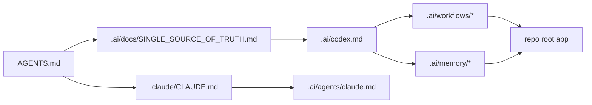

# AI Harness

`.ai/` is the checked-in helper harness for the Chatbox workspace. It is not
product code. It holds reusable instructions, workflows, memory scaffolds, and
templates that support work in the real app at the repo root.

## Directory Map

- `codex.md`: canonical Codex orchestrator for this workspace
- `docs/README.md`: durable harness docs and reference index
- `memory/README.md`: durable versus session memory layout
- `workflows/README.md`: repeatable execution playbooks
- `agents/README.md`: compatibility mirrors and role prompts
- `skills/README.md`: local skill inventory and guidance
- `templates/README.md`: spec and planning scaffolds
- `state/README.md`: helper runtime state for the harness itself

## Harness Boundary

- Keep `.ai/` generic to this repository.
- Do not move product features or runtime implementation into this directory.
- Treat the repo root as the runnable application surface for Chatbox.

## Diagram

